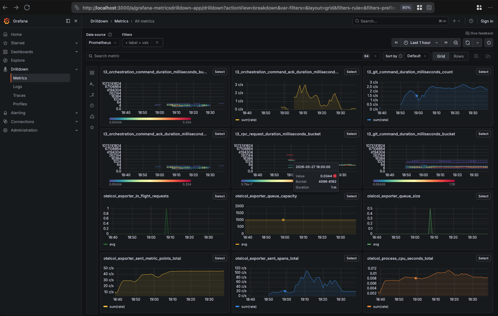

# otel

alpha software, version 0.0.1, things are broken, use at own peril

## Grafana LGTM OTel repo on Apple Containers

Local LGTM-style OpenTelemetry stack for macOS using Apple's
`container` CLI. Decomposes the upstream
[`grafana/docker-otel-lgtm`](https://github.com/grafana/docker-otel-lgtm)
image.

This repo decomposes the upstream `grafana/otel-lgtm` image into separate
Apple-managed containers for:

- Prometheus
- Loki
- Tempo
- Pyroscope
- OpenTelemetry Collector
- Grafana

The result is a local stack that exposes the same main developer-facing
ports as the upstream image while staying compatible with Apple
Containers' current runtime constraints.

## What This Stack Does



The screenshot shows the Grafana dashboard with all four observability backends
(Loki, Grafana, Tempo, Metrics/Prometheus) integrated and provisioned,
displaying unified visibility into logs, traces, metrics, and profiles from
your applications.

Once running, the stack gives you:

- OTLP gRPC ingest on `localhost:4317`
- OTLP HTTP ingest on `localhost:4318`
- collector health on `localhost:13133/ready`
- Prometheus on `localhost:9090`
- Tempo on `localhost:3200`
- Pyroscope on `localhost:4040`
- Grafana on `localhost:3000`

The collector fans signals out to the backend services:

- metrics -> Prometheus
- logs -> Loki
- traces -> Tempo
- profiles -> Pyroscope

Grafana is provisioned with datasources for all four backends.

## How This Differs From `grafana/otel-lgtm`

This repo is not a wrapper around the monolithic upstream image. It is a
decomposed stack.

Key differences:

- Upstream runs one bundled image, assumes a Docker-like runtime. This repo 
  runs six separate OCI containers targeting Apple's `container` CLI on macOS.
- Upstream includes optional OBI/eBPF support. This repo intentionally
  defers OBI. You can implement or fork if you want.
- Upstream is one artifact. This repo lets you start or debug services
  individually.

The goal is to provide the same local observability end-user experience,
not byte-for-byte runtime parity.

## Prerequisites

- macOS with Apple's `container` CLI installed
- local containers or networking to download them
- `awk`
- `curl`

Before first use, make sure the runtime is available:

```sh
container system status
```

If it is not running, the repo scripts will attempt to start it.

## Quick Start

1. Clone or download the repo.
2. Enter the repo directory.
3. Copy the environment template:

```sh
cp .env.example .env
```

4. Review `.env` if you want to change stack names, resource limits,
   credentials, or timeouts.
5. Bootstrap the runtime and pull images:

```sh
./scripts/bootstrap.sh
```

6. Start the full stack:

```sh
./scripts/lgtm-up.sh
```

7. Verify health:

```sh
./scripts/lgtm-status.sh
./scripts/smoke-test.sh
```

8. Open Grafana:

```text
http://localhost:3000
```

Default credentials come from `.env`:

- username: `admin`
- password: `admin`

Anonymous access is enabled by default in this repo. This is not a bug.

## Start Services Individually

You can also bring services up one at a time.

Suggested order:

1. `./scripts/prometheus-up.sh`
2. `./scripts/loki-up.sh`
3. `./scripts/tempo-up.sh`
4. `./scripts/pyroscope-up.sh`
5. `./scripts/otelcol-up.sh`
6. `./scripts/grafana-up.sh`

Matching teardown scripts exist for each service in `scripts/*-down.sh`.

## Common Commands

Bring the full stack up:

```sh
./scripts/lgtm-up.sh
```

Bring the full stack down but keep volumes:

```sh
./scripts/lgtm-down.sh
```

Bring the full stack down and also remove volumes:

```sh
REMOVE_VOLUMES=true ./scripts/lgtm-down.sh
```

Show container status:

```sh
./scripts/lgtm-status.sh
```

Show logs for all services:

```sh
./scripts/lgtm-logs.sh
```

Show logs for one service:

```sh
./scripts/lgtm-logs.sh grafana
./scripts/lgtm-logs.sh otelcol
```

Run the smoke test:

```sh
./scripts/smoke-test.sh
```

## Repo Layout

```text
.
├── README.md
├── LICENSE
├── CHANGELOG.md
├── PLAN.md
├── versions.env
├── configs/
│   ├── templates/
│   └── rendered/
├── docs/
│   └── decisions.md
└── scripts/
```

Important conventions:

- `configs/templates/` is source-controlled input config.
- `configs/rendered/` is generated runtime output.
- `configs/rendered/grafana-provisioning/` is generated and should not be
  treated as source of truth.
- `versions.env` pins image tags.
- `docs/decisions.md` records runtime-specific decisions.
- `PLAN.md` captures the implementation plan and scope.

## Generated Files

Runtime config is rendered by:

```sh
./scripts/render-configs.sh
```

That script writes generated files into `configs/rendered/`, including:

- service config YAML files
- Grafana datasource config
- rendered Grafana provisioning tree

Do not hand-edit generated files unless you are debugging locally and
understand they may be replaced on the next render.

## Known Apple Containers Constraints

This repo currently assumes:

- directory bind mounts are reliable, single-file host bind mounts are
  not in this workflow; generated config is therefore mounted as a
  directory such as `configs/rendered/` or
  `configs/rendered/grafana-provisioning/`, and processes read the
  specific files from inside that directory
- backend service discovery is rendered by IP instead of relying on
  container-name DNS; in a local repro on Apple `container` `0.12.3`, a
  client container on the same custom network could fetch
  `http://<peer-ip>:8080` but failed to resolve
  `http://<peer-name>:8080`
- several services need `0:0` on fresh named volumes

Those constraints are reflected in the scripts and are documented in
`docs/decisions.md`.

## Related Docs

- [PLAN.md](./PLAN.md)
- [docs/decisions.md](./docs/decisions.md)
